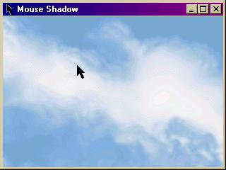



## Mouse Shadow

### Description

This will draw a shadow of the mouse as you move it across the form (without any flickering). You can draw the shadow on anything that has a handle. This was kinda tricky to do (removeing the flicker was anyway), but it's actually only about a day's work. Looks cool though. Any suggestions for improving it are very welcome. And thanks in advance to anyone who votes.
 
### More Info
 

             |
---                |---
**Submitted On**   |2001-12-16 23:28:20
**By**             |[Eric O'Sullivan](https://github.com/Planet-Source-Code/PSCIndex/blob/master/ByAuthor/eric-o-sullivan.md)
**Level**          |Advanced
**User Rating**    |4.0 (8 globes from 2 users)
**Compatibility**  |VB 5\.0, VB 6\.0
**Category**       |[Graphics](https://github.com/Planet-Source-Code/PSCIndex/blob/master/ByCategory/graphics__1-46.md)
**World**          |[Visual Basic](https://github.com/Planet-Source-Code/PSCIndex/blob/master/ByWorld/visual-basic.md)
**Archive File**   |[Mouse\_Shad4252812162001\.zip](https://github.com/Planet-Source-Code/eric-o-sullivan-mouse-shadow__1-29853/archive/master.zip)

